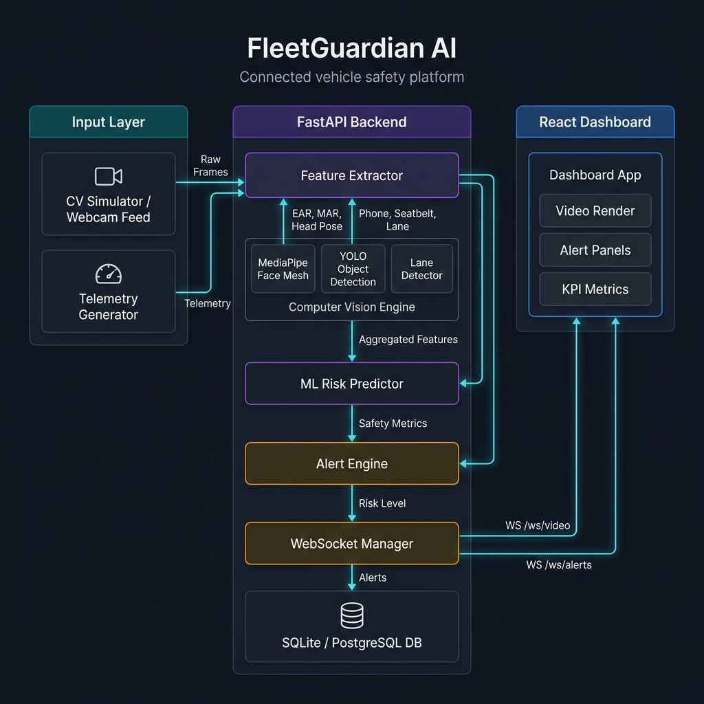
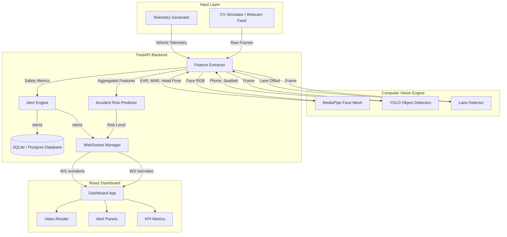
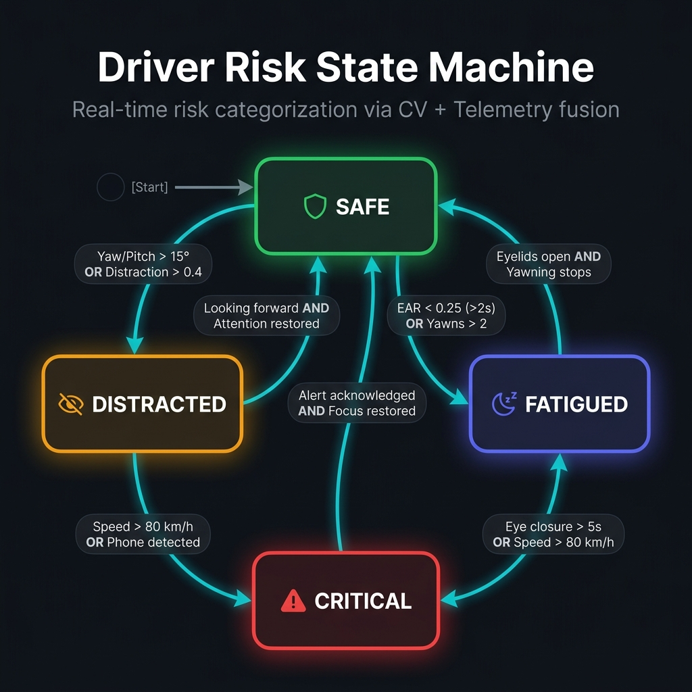
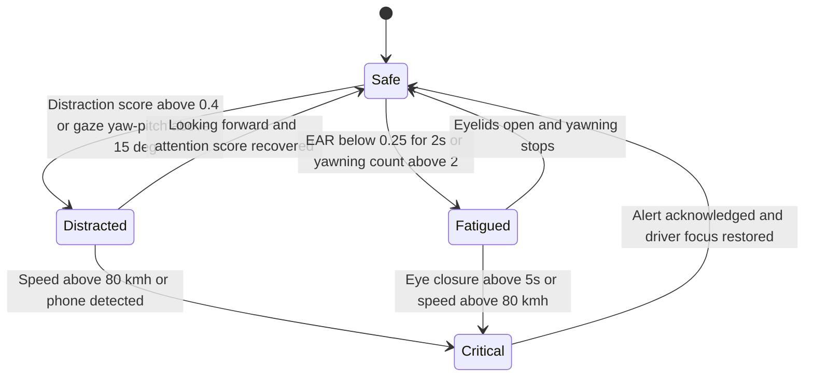

# FleetGuardian AI

> Production-oriented Connected Vehicle and Driver Safety platform utilizing Real-Time Computer Vision and Edge Telemetry fusion.

[](https://www.python.org/)
[](https://fastapi.tiangolo.com/)
[](https://react.dev/)
[](https://www.sqlite.org/)
[](https://www.docker.com/)
[](https://opencv.org/)
[](https://developers.google.com/mediapipe)
[](https://prometheus.io/)
[](https://grafana.com/)
[](LICENSE)

---

## 1. Project Overview

FleetGuardian AI is a production-grade, end-to-end MVP designed for connected vehicle fleet managers to monitor driver behavior and vehicle status in real time. The platform integrates:
- An **asynchronous FastAPI backend** managing WebSocket connections, REST APIs, database sessions, and simulated vehicle telemetry loops.
- A **real-time Computer Vision engine** powered by OpenCV and MediaPipe (Face Mesh) for facial feature parsing (EAR, MAR, Head Pose) combined with custom YOLO11 inference models for object detection (mobile phone distraction, seatbelt compliance).
- An **edge-triggered alert and rule engine** that logs safety violations (drowsiness, speed limits, lane departures) and penalizes driver safety scores.
- A **state-driven React 19 dashboard** that subscribes to live metrics, visualizes driver focus/head direction dials, manages local webcam permissions based on speed thresholds, and lists historical safety incidents.

---

## 2. Problem Understanding

Commercial fleet operations face substantial liability and safety challenges due to driver distraction and fatigue. Traditional telematics capture only low-frequency vehicle data (GPS, speed spikes), omitting the critical human element. FleetGuardian AI solves this by:
1. **Unifying Vision and Telemetry**: Correlating vehicle speed and lane stability with driver-side metrics like blink duration, yawn frequency, and gaze direction.
2. **Minimizing Cognitive Overhead**: Running edge inference models that translate raw video frames into standardized float features, enabling the system to evaluate accident risks via a machine learning classifier rather than complex nested heuristics.
3. **Optimizing Network Bandwidth**: Deduplicating consecutive event frames at the backend safety layer and using WebSockets to send lightweight serialized payloads (Base64 frame streams + metric coordinates) to remote operations desks.

---

## 3. System Architecture

FleetGuardian AI maps inputs, computer vision detectors, backend logic pipelines, database state management, and dashboard visualization blocks:





---

## 4. Folder Structure

```text
FleetGuardian-AI/
├── app/                        # FastAPI Backend Application
│   ├── api/                    # REST API routers (drivers, trips, reports, analytics)
│   ├── core/                   # Security, configs, and logger initializers
│   ├── cv/                     # Computer Vision Core Engine
│   │   ├── distraction/        # Head pose & gaze estimation algorithms
│   │   ├── drowsiness/         # Eye Aspect Ratio (EAR) & Yawning (MAR) counters
│   │   ├── feature_extraction/ # Aggregation pipeline of all CV outputs
│   │   ├── inference/          # Inference pipeline coordination
│   │   ├── lane_detection/     # OpenCV Hough-line lane tracking
│   │   ├── phone_detection/    # YOLO phone presence checks
│   │   ├── seatbelt_detection/ # YOLO seatbelt compliance checks
│   │   ├── utils/              # Model loaders & mathematical helper functions
│   │   └── visualization/      # Bounding box & face landmark overlay routines
│   ├── database/               # Session configuration & base definitions
│   ├── middleware/             # SQLite / Postgres session context managers
│   ├── models/                 # SQLAlchemy schemas (users, vehicles, alerts, trips)
│   ├── pipelines/              # Safety pipeline (fusing CV, ML & alerts)
│   ├── repositories/           # CRUD database layers
│   ├── schemas/                # Pydantic schemas for request/response validation
│   ├── services/               # Core services (authentication, reports, alert engines)
│   ├── tests/                  # Pytest unit and integration test scripts
│   └── websocket/              # Asynchronous connection broadcast managers
├── configs/                    # System & application configuration profiles
├── datasets/                   # Seed files and dataset management scripts
├── docs/                       # Project documentation & media resources
│   └── assets/                 # UI screenshots and demo recording
├── frontend/                   # React 19 Frontend Dashboard
│   ├── src/                    # Source files (App.tsx, main.tsx, styles.css)
│   ├── index.html              # HTML shell
│   └── vite.config.ts          # Vite server config
├── grafana/                    # Grafana telemetry dashboard configuration
├── nginx/                      # Proxy rules serving static assets
├── prometheus/                 # Prometheus system metrics scraper rules
├── requirements.txt            # Python backend dependencies
└── docker-compose.yml          # Multi-container orchestration blueprint
```

---

## 5. Technologies Used

| Layer | Technology | Responsibility |
| :--- | :--- | :--- |
| **Input / Simulation** | `OpenCV` | Acquires camera frames, performs normalization, and encodes processed video as Base64. |
| **CV Inference** | `MediaPipe Face Mesh` | Tracks 478 face mesh coordinates to compute eye and mouth closure metrics. |
| **CV Object Detection** | `YOLO11 Nano` | Runs lightweight object classification to locate phone and seatbelt coordinates. |
| **Backend Framework** | `FastAPI (Uvicorn)` | Orchestrates REST API controllers and hosts asynchronous WebSocket channels. |
| **Persistence Layer** | `PostgreSQL / SQLite` | Stores trip logs, user records, driver history, and edge-triggered safety alerts. |
| **ORM / Migration** | `SQLAlchemy` | Maps Python classes to relational database tables with foreign key constraints. |
| **Frontend Framework** | `React 19 / TS / Vite` | Decodes Base64 stream, manages client state, and displays gauges/maps. |
| **Observability** | `Prometheus & Grafana` | Exposes performance metrics and charts HTTP response latencies. |
| **Containerization** | `Docker & Compose` | Wraps frontend, backend, database, and telemetry monitoring in isolated boxes. |

---

## 6. Features

- **Multi-Modal Fatigue Tracking**: Computes real-time Eye Aspect Ratio (EAR) and Mouth Aspect Ratio (MAR) to catch eyelid closures (fatigue) or continuous yawning.
- **Head Pose Estimation via solvePnP**: Uses 3D landmark anchors matched to a generic head model to resolve Yaw, Pitch, and Roll angles, detecting mirrors check vs. phone distraction.
- **YOLO-based Threat Detection**: Integrated YOLO model checks for cellular device exposure and seatbelt harness omission.
- **Telemetry Fusion Rule Engine**: Correlates vehicle speeds with CV variables. Triggers alerts immediately when safety thresholds are violated.
- **Automatic Camera Hook**: Dashboard monitors telemetry stream; if speed exceeds `5 km/h`, the web page automatically starts the webcam stream to track the driver, closing the camera connection when the vehicle halts to optimize resources.
- **Unified Alert Console**: Visual notifications categorized by priority (`critical`, `warning`, `notice`) matching color-coded event feeds.
- **Docker Orchestrated Deployment**: Runs a complete stack containing database, telemetry visualizers, dashboards, and metrics scrapers in one command.

---

## 7. Driver Risk State Machine

The driver's risk category is continuously calculated by the backend safety pipeline based on eye status, head directions, phone presence, and vehicle speed:





---

## 8. Computer Vision & Telemetry Sensors

The Feature Extractor processes each frame, converting visual elements into numeric variables:

| Sensor / Metric | Source | Extraction Method | Default Trigger Threshold |
| :--- | :--- | :--- | :--- |
| **Eye Aspect Ratio (EAR)** | MediaPipe | $\frac{\|P_2 - P_6\| + \|P_3 - P_5\|}{2 \cdot \|P_1 - P_4\|}$ | `< 0.25` (indicates closed eyelids) |
| **Mouth Aspect Ratio (MAR)** | MediaPipe | Mouth corner horizontal vs. lip vertical height ratio | `> 0.60` (indicates yawn expansion) |
| **Head Pose Yaw / Pitch** | MediaPipe + OpenCV | `cv2.solvePnP` matching 2D landmarks with 3D model | `> 15.0°` (driver looking away) |
| **Attention Score** | Distraction Estimator | Temporal decay: $1.0 - \frac{\text{seconds looking away}}{10.0}$ | `< 0.50` (triggers warning banner) |
| **Phone Presence** | YOLO11 | Bounding box classification for class label `cell phone` | Binary detection (confidence `> 0.40`) |
| **Seatbelt Status** | YOLO11 | Diagonal strap presence over driver torso region | Binary omission (absent alert) |
| **Lane Offset** | Lane Detector | Horizontal distance from detected Hough lanes | `> 0.25` deviation (lane drift warning) |
| **Vehicle Speed** | Telemetry Feed | Direct CAN bus simulation telemetry | `> 80.0 km/h` (speeding alert) |

---

## 9. WebSocket & REST APIs

### WebSocket Channels

| Route / Channel | Direction | Action / Event | JSON Payload Attributes |
| :--- | :--- | :--- | :--- |
| `/ws/video` | Client $\to$ Server | `start_stream` | `{"action": "start_stream", "driver_id": 1, "vehicle_id": 1, "trip_id": 1}` |
| `/ws/video` | Client $\to$ Server | `stop_stream` | `{"action": "stop_stream"}` |
| `/ws/video` | Server $\to$ Client | Live feed updates | `{"image": "data:image/jpeg;base64,...", "metrics": {...}, "risk_level": "High"}` |
| `/ws/alerts` | Client $\to$ Server | `listen` | `{"action": "listen"}` |
| `/ws/alerts` | Server $\to$ Client | `alert_triggered` | `{"event": "alert_triggered", "alert": {...}, "driver_id": 1, "vehicle_id": 1}` |

### REST Endpoints (v1)

| Method | Endpoint | Access Level | Description |
| :--- | :--- | :--- | :--- |
| `GET` | `/health` | Public | Returns server health and Unix timestamp. |
| `POST` | `/api/v1/auth/login` | Public | Authenticates credentials; yields JWT access token. |
| `GET` | `/api/v1/drivers` | Viewer+ | Retrieves metadata and scores for registered drivers. |
| `GET` | `/api/v1/vehicles` | Viewer+ | Lists available vehicles and operational statuses. |
| `POST` | `/api/v1/trips` | Manager+ | Initiates a new trip session; marks driver as on trip. |
| `PUT` | `/api/v1/trips/{id}/end` | Manager+ | Terminates an active trip; recalculates average speeds. |
| `GET` | `/api/v1/alerts` | Viewer+ | Queries historical safety alerts from the database. |
| `POST` | `/api/v1/alerts/{id}/acknowledge` | Manager+ | Acknowledges an active safety infraction. |
| `GET` | `/api/v1/analytics/summary` | Viewer+ | Computes fleet infraction frequencies and charts. |

---

## 10. Safety Pipeline Validation & Rules

The Alert Engine runs frame-by-frame validations against telemetry inputs and CV metrics. When a violation is triggered, it persists the incident in the database and updates the active driver safety score:

- **Drowsiness Alert**:
  - *Trigger Condition*: EAR remains `< 0.25` for $\ge 3$ consecutive frames.
  - *Severity*: `Critical`
  - *Driver Score Penalty*: `-10.0` points
- **Phone Distraction Alert**:
  - *Trigger Condition*: YOLO registers a mobile phone with confidence `> 0.40`.
  - *Severity*: `High`
  - *Driver Score Penalty*: `-15.0` points
- **Seatbelt Alert**:
  - *Trigger Condition*: YOLO registers no diagonal strap layout while vehicle speed $> 0$.
  - *Severity*: `High`
  - *Driver Score Penalty*: `-10.0` points
- **Lane Departure Warning**:
  - *Trigger Condition*: Absolute lane offset exceeds `0.25` meters.
  - *Severity*: `Medium`
  - *Driver Score Penalty*: `-5.0` points
- **Speed Violation**:
  - *Trigger Condition*: Telemetry speed exceeds `80.0 km/h`.
  - *Severity*: `Medium`
  - *Driver Score Penalty*: `-10.0` points

---

## 11. Event Detection and Alert Pipeline

To prevent duplicate logs (e.g. logging 30 alerts per second when the driver yawns), the platform employs a **stateful edge-triggered deduplication** logic:
1. **Infraction Hold State**: When an alert type (e.g., `phone_usage`) is triggered, the system logs the incident.
2. **Debounce Interval**: Additional triggers of the same alert type are suppressed for a cooldown period (e.g., 5 seconds) unless the severity level shifts.
3. **Score Reconstruction**: Driver scores start at `100.0`. Penalties reduce this value dynamically.
4. **Attention Score Decay**: Attention score decays linearly when the head angle exceeds $15^\circ$:
   $$\text{Attention Score} = \max\left(0.0, 1.0 - \frac{\text{Looking Away Seconds}}{10.0}\right)$$

---

## 12. Database Schema

The SQLite schema represents the relational mappings of the platform:

```json
{
  "users": {
    "id": "INTEGER (PK)",
    "email": "VARCHAR (Unique, Index)",
    "hashed_password": "VARCHAR",
    "full_name": "VARCHAR",
    "role": "VARCHAR (admin / manager / viewer)",
    "is_active": "BOOLEAN"
  },
  "drivers": {
    "id": "INTEGER (PK)",
    "employee_id": "VARCHAR (Unique, Index)",
    "name": "VARCHAR",
    "license_number": "VARCHAR",
    "phone": "VARCHAR",
    "email": "VARCHAR",
    "current_status": "VARCHAR (active / on_trip / resting)",
    "safety_score": "FLOAT (Default 100.0)",
    "total_trips": "INTEGER",
    "total_violations": "INTEGER"
  },
  "vehicles": {
    "id": "INTEGER (PK)",
    "vin": "VARCHAR (Unique)",
    "plate_number": "VARCHAR (Unique)",
    "make": "VARCHAR",
    "model": "VARCHAR",
    "year": "INTEGER",
    "status": "VARCHAR (active / maintenance)",
    "current_speed": "FLOAT",
    "current_latitude": "FLOAT",
    "current_longitude": "FLOAT"
  },
  "trips": {
    "id": "INTEGER (PK)",
    "driver_id": "INTEGER (FK drivers.id)",
    "vehicle_id": "INTEGER (FK vehicles.id)",
    "start_time": "DATETIME",
    "end_time": "DATETIME (Nullable)",
    "status": "VARCHAR (active / completed)",
    "average_speed": "FLOAT",
    "max_speed": "FLOAT"
  },
  "alerts": {
    "id": "INTEGER (PK)",
    "trip_id": "INTEGER (FK trips.id)",
    "driver_id": "INTEGER (FK drivers.id)",
    "vehicle_id": "INTEGER (FK vehicles.id)",
    "type": "VARCHAR (drowsiness / phone_usage / seatbelt_absent / lane_departure / speed_violation)",
    "severity": "VARCHAR (critical / high / medium / low)",
    "timestamp": "DATETIME",
    "status": "VARCHAR (active / acknowledged)",
    "acknowledged_by": "INTEGER (FK users.id, Nullable)"
  },
  "predictions": {
    "id": "INTEGER (PK)",
    "trip_id": "INTEGER (FK trips.id)",
    "driver_id": "INTEGER (FK drivers.id)",
    "vehicle_id": "INTEGER (FK vehicles.id)",
    "drowsiness_score": "FLOAT",
    "phone_usage_frequency": "FLOAT",
    "seatbelt_present": "BOOLEAN",
    "lane_departure_count": "INTEGER",
    "speed": "FLOAT",
    "distraction_score": "FLOAT",
    "risk_level": "VARCHAR (low / medium / high / critical)"
  }
}
```

---

## 13. Setup and Installation

### Prerequisites
- Install **Docker Desktop** (with Docker Compose version $\ge 2.20.0$).
- Clone this repository.

### Launching the Stack
1. **Configure Environment Variables**:
   Copy the environment variables template and configure your secrets:
   ```bash
   cp .env.example .env
   ```
2. **Build and Run Containers**:
   Launch the system in background daemon mode:
   ```bash
   docker compose up -d --build
   ```
3. **Verify Container Status**:
   ```bash
   docker compose ps
   ```
4. **Access the Portals**:
   - **Frontend Dashboard**: `http://localhost` (Port 80)
   - **FastAPI Documentation**: `http://localhost:8000/docs`
   - **Prometheus Console**: `http://localhost:9090`
   - **Grafana Visualization**: `http://localhost:3000` (Default credentials: `admin` / `admin`)

---

## 14. Running Each Module Locally

To develop, configure, or run the sub-modules directly inside local shells without containers, follow these steps:

### Backend Development Setup
1. **Initialize Virtual Environment**:
   ```powershell
   python -m venv venv
   .\venv\Scripts\Activate.ps1
   ```
2. **Install Core Dependencies**:
   ```powershell
   pip install -r requirements.txt
   ```
3. **Set Path and Run**:
   ```powershell
   $env:PYTHONPATH="."
   uvicorn app.main:app --reload --host 0.0.0.0 --port 8000
   ```
4. Check health by accessing `http://localhost:8000/health`.

### Frontend Development Setup
1. **Navigate and Install Node Modules**:
   ```powershell
   cd frontend
   npm install
   ```
2. **Run Vite Dev Server**:
   ```powershell
   npm run dev -- --port 5173 --host 0.0.0.0
   ```
3. Access dashboard from your browser: `http://localhost:5173`.

---

## 15. Dashboard Features

The React 19 Frontend Dashboard provides a real-time command center:
1. **Telemetry KPI Tiles**: Large tiles monitoring speed (km/h), calculated engine RPM, remaining fuel, and overall risk levels.
2. **Adaptive Video Box**: Shows base64 processed frames when simulator is running. If speed exceeds $5\text{ km/h}$, browser permissions request the local webcam to record the driver.
3. **Real-time Incident Feed**: Lists security and safety violations as they trigger. Cards are colored by severity (red for critical, yellow for warning).
4. **Driver Movement Map**: Simulates vehicle routing over regional coordinates, updating maps live.

---

## 16. Known Limitations

- **Webcam Hardware Access**: Virtual environments and remote hosts may face restrictions access permissions for `getUserMedia` over non-HTTPS connections.
- **Model Processing Overhead**: High frame-rate processing can saturate single-core CPU threads; standard performance achieves ~6-8 frames-per-second on non-GPU cores.
- **SQLite Write Concurrency**: SQLite may experience database locks during simultaneous writing of high-frequency alerts and predictions; configured default timeouts address this.

---

## 17. Future Improvements

- **Edge Deployment Integration**: Compiling the Python CV modules for NVIDIA Jetson Nano or Raspberry Pi using TensorRT.
- **Biometric Identification**: Multi-tenant authentication verifying driver credentials via facial matching.
- **SMS / Email Alerts**: Hooking Twilio Webhooks into the backend to alert fleet managers via mobile notifications.
- **Advanced Lane Analysis**: Upgrading Hough line lane detection to deep learning models (e.g. Ultra-Fast-Lane-Detection).

---

## 18. Screenshots and Demo Assets

| Screenshot | Path | Description |
| :--- | :--- | :--- |
| **Initial Login Portal** | [login-screen.png](file:///c:/Resume-Project/FleetGuardian-AI/docs/assets/login-screen.png) | Credential interface for admins. |
| **Live Telemetry Interface** | [live-dashboard-top.png](file:///c:/Resume-Project/FleetGuardian-AI/docs/assets/live-dashboard-top.png) | Real-time sensor dashboard displaying active gauges. |
| **Incident Timeline Log** | [live-dashboard-alerts.png](file:///c:/Resume-Project/FleetGuardian-AI/docs/assets/live-dashboard-alerts.png) | Infraction feeds. |

### Demo Video
A complete walkthrough video showing live telemetry simulation and alert triggers is located in:
[docs/assets/demo-recording.mp4](file:///c:/Resume-Project/FleetGuardian-AI/docs/assets/demo-recording.mp4)

---

## 19. License

Distributed under the MIT License. See `LICENSE` for more information.
